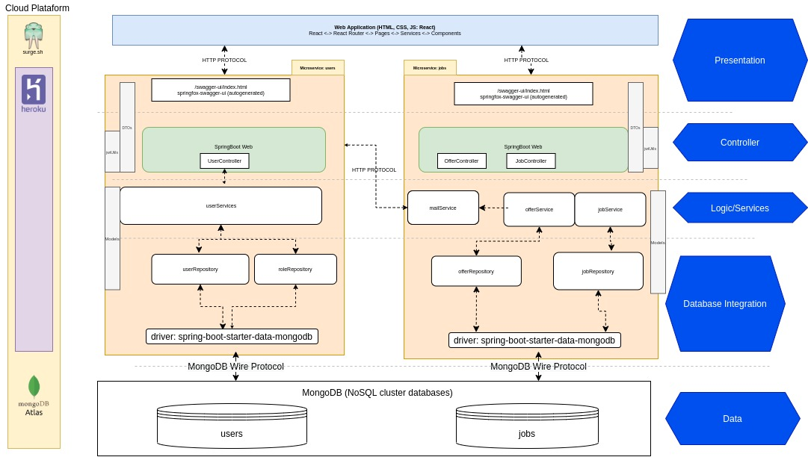
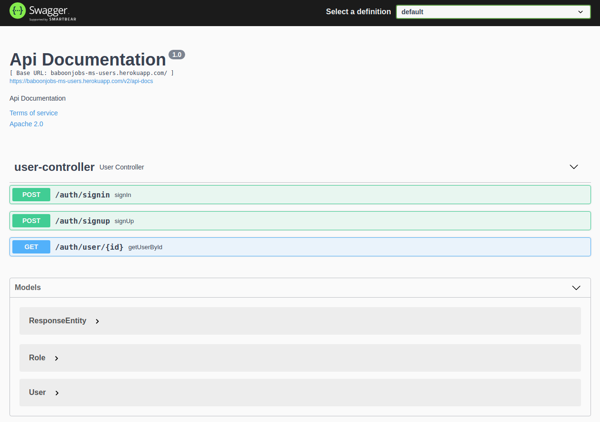

# baboonjobs-ms-users
Baboonjobs-ms-users is  a REST microservice for BaboonJobs. Its functionality is user management and authorization:
* Create user account
* Generate authorization token for registered users
* Return user information


See Baboonjobs projects:
* baboonjobs-ms-users: https://github.com/baboondev/baboonjobs-ms-users **(this project)**
* baboonjobs-ms-jobs: https://github.com/baboondev/baboonjobs-ms-jobs
* baboonjobs-frontend: https://github.com/baboondev/baboonjobs-frontend

## Table of contents

- [baboonjobs-ms-users](#baboonjobs-ms-users)
  * [Contents](#contents)
  * [About Baboonjobs](#about-baboonjobs)
    + [Architecture chart:](#architecture-chart-)
      - [Backend](#backend)
      - [Frontend](#frontend)
    + [Deploy](#deploy)
  * [Requirements](#requirements)
  * [Install and run](#install-and-run)
      - [Configure properties](#configure-properties)
  * [Database Documents Schemas](#database-documents-schemas)
      - [User](#user)
      - [Role](#role)
  * [Endpoints](#endpoints)
  * [Screenshots](#screenshots)

## About Baboonjobs
Baboonjobs is a web application for posting job offers and proposals. It is the integrative project for the subject "Java Application on Web" of the Computer Engineering course at the Arturo Jauretche National University.

### Architecture chart:


#### Backend

Microservices architecture was used for the backend. There were two microservices: users and jobs. Each of them is a REST service

These were developed in Java with spring boot as framework and both were documents with swagger. 
Regarding data persistence for both microservices, MongoDB (NoSQL database) was chosen. They are hosted in a Mongo Atlas cluster.

JWT (json web token) is used for application authentication using the packages provided by spring.

#### Frontend
For the frontend we used the React library to generate a SPA web application. As main dependencies we used react-router-dom for routing and Redux for state management.

The frontend connects to the endpoints of the backend microservices to obtain information. Access tokens are obtained in the user microservice.

### Deploy
The application is deployed on the following cloud services: 
* [Heroku](https://www.heroku.com/java) for Backend
* [Surge](https://surge.sh/) for Frontend
* [MongoDB Atlas](https://www.mongodb.com/atlas/database) for the database 

## Requirements 

+ Java JDK 17 https://jdk.java.net/17/
+ Apache Maven: https://maven.apache.org/
+ Mongo DB Database: https://www.mongodb.com/es/atlas


## Install and run

```shell
# Clone project
> git clone https://github.com/baboondev/baboonjobs-ms-users.git
> cd baboonjobs-ms-users
# After config properties, Install mvn dependencies
> mvn clean install
# Run
> mvn spring-boot:run
```
You can see others ways how to run a spring-boot application in this article: https://docs.spring.io/spring-boot/docs/2.0.x/reference/html/using-boot-running-your-application.html
#### Configure properties

Go to the file `src/main/resources/application.properties` and replace values
```
spring.data.mongodb.uri=YOUR_MONGODB_URI
spring.data.mongodb.database=YOUR_MONGO_DATABSE
server.port=PORT
```

## Database Documents Schemas
#### User
```javascript
{
	_id: "ObjectId",
	firstname: "String",
	lastname: "String",
	email: "String",
	password: "String",
	role: "Role"
}
```
#### Role
```javascript
{
	_id: "ObjectId",
	name: "String"
}
```

## Endpoints
This is a brief overview of the endpoints. To see them in detail please visit the documentation generated in Swagger in your project at `<YOUR_URL_APP>/swagger-ui/index.html`

| Method | Endpoint        | Description                                                  |
| ------ | --------------- | ------------------------------------------------------------ |
| `POST` | /auth/signin    | Get user information and an access token if the credentials (email, password) sent are correct. <br />**Body:** `{"email": "string", "password": "string"}`<br />**Responses**: 200, 401, 500 |
| `POST` | /auth/signup    | Create a new user<br />**Params**: role (employee/employer)<br />**Body**: `{   "email": "string",   "firstname": "string",   "lastname": "string",   "password": "string"}`<br />**Responses**: 201, 500 |
| `GET`  | /auth/user/{id} | Get user data from a user id<br /> **Path**: id<br />**Responses**: 200, 401 |


## Screenshots

Swagger Docs:


